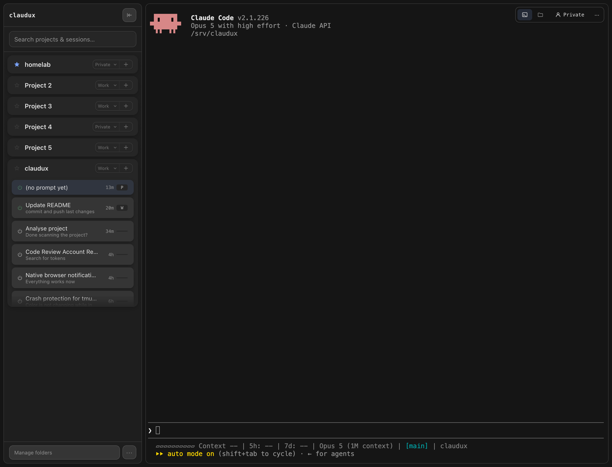
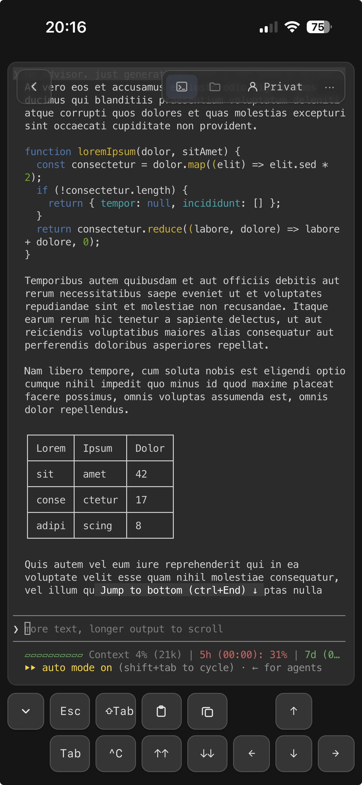

# claudux

[](https://github.com/snazzybean/claudux/actions/workflows/ci.yml)
[](https://github.com/snazzybean/claudux/releases/latest)
[](LICENSE)

[](https://ko-fi.com/snazzybean)

**Claude Code sessions in a browser tab, phone included.**
tmux keeps the sessions alive, ttyd brings them into the browser, and an
Express server serves the interface and the API.

> [!TIP]
> Put it somewhere that stays on. A Docker container, an always-on LXC, a
> spare machine in the corner and your sessions are there whenever you are:
> from the couch, from the office, from a phone on the train. They keep running
> while nothing is looking at them. Reaching it from outside your own network
> wants a reverse proxy or a VPN in front.

<div align="center">
<table>
  <tr>
    <td valign="top">
      
    </td>
    <td valign="top">
      
    </td>
  </tr>
</table>
</div>

## What it does

The interface lists projects with their sessions, starts new ones and resumes
existing ones. Alongside that:

- **No API key.** Sessions run on an account token from `claude setup-token`,
  the same login a subscription uses. Several accounts can be stored, and
  which one a session runs on is picked when it starts.
- **A key bar** for the keys a screen keyboard doesn't have: Esc, Tab, Ctrl,
  arrows.
- **Images from the clipboard**, pasted straight into the conversation.
- **Copying out of the terminal**, on a phone too, where a browser selection
  would come up empty.
- **Push notifications** when a session is waiting for input, via browser,
  ntfy or webhook — quiet while it is still working, and adjustable per
  project.
- **A usage popover** with context level and quota.
- **The project's files** in a second tab, readable and editable.
- **Sessions that outlive the browser**, because they live in tmux. A crash
  of `claude` no longer takes the session down with it.

Desktop and phone get the same features; what a small screen makes awkward
(no hover, no Ctrl key, a keyboard covering half the page) has its own answer
here rather than being left to the browser.

## Requirements

| | |
|---|---|
| Node.js | ≥ 22.15.0 |
| tmux | default socket, mouse mode **off** |
| ttyd | started by claudux itself via `npm start` |
| Claude Code | logged in with an account token from `claude setup-token` (subscription), not with an API key |

## Setup

### npx

One command, nothing to clone:

```sh
npx github:snazzybean/claudux
```

tmux and ttyd stay prerequisites — if one is missing, installing it is
offered, never done unasked. The Claude Code CLI is reported when it is
missing and installed separately, the way its own
[documentation](https://docs.claude.com/claude-code) describes.

### Docker

Just to look at it, installing nothing:

```sh
docker run -p 4001:4001 \
  -v claudux-home:/home/claudux \
  -v /path/to/your/projects:/projects \
  ghcr.io/snazzybean/claudux:latest
```

`claudux-home` is a named volume, not a path; replace
`/path/to/your/projects` with the directory your projects live in. The volume
covers the whole home directory rather than just `.claudux`, because Claude
Code keeps the session history the list reads in `.claude`, right beside it.

Sessions then run **inside the container**, which brings Node, tmux, ttyd, git
and the Claude Code CLI. Whatever your own projects build with — another
language runtime, a compiler, a database client — has to be installed in there
before a session can use it.

### From a checkout

```sh
git clone https://github.com/snazzybean/claudux.git
cd claudux
git -c advice.detachedHead=false checkout "$(git describe --tags --abbrev=0)"
npm install
npm run setup
npm start
```

`npm run setup` belongs to this path alone: it offers to install a missing
tmux or ttyd via the detected package manager (asking first, and outside
Homebrew through `sudo`), reports whether the Claude Code CLI is there, and
creates `.env` from `.env.example`.

The checkout of the latest tag is what lets the interface keep itself current
(see [Updating](#updating) below). Git has no `latest` ref, hence the
subshell: `git describe` picks the newest tag reachable from `HEAD`, which
after a fresh clone is the latest release.

### First start

Whichever of the three you took, open `http://localhost:4001` and pick a
password on the screen that comes up. Do that before the machine's other
addresses see traffic — the first caller sets it. From then on the same
interface answers on every address of the machine; `HOST` narrows that down,
see [Security](#security) below.

## Configuration

All values come from the environment; `.env.example` lists every variable,
with the defaults in the comments. None of them has to be set for a working
installation:

| Variable | Meaning |
|---|---|
| `PORT` | port of the Express server |
| `HOST` | interface it binds to, `0.0.0.0` by default (see Security) |
| `CLAUDE_HOME` | Claude Code's directory, source of session histories |
| `DATA_DIR` | project list and session metadata, **outside** the checkout by default |
| `AUTH_ENABLED` | the login, on unless set to `false` (see Security) |
| `ACCESS_SECRET_PATH` | site password and sessions, **outside** the checkout |
| `ACCOUNTS_SECRET_PATH` | account tokens, **outside** the checkout |
| `NOTIFICATION_TARGETS_PATH` | notification targets, **outside** the checkout |
| `PROJECTS_BROWSE_ROOT` | root of the "+ Add folder" browse dialog, `$HOME` by default |
| `IDLE_THRESHOLD_MS` | when the reaper ends a dormant session |
| `UNUSED_IDLE_THRESHOLD_MS` | shorter deadline for sessions without any prompt |
| `LOGIN_IDLE_THRESHOLD_MS` | shorter still for an abandoned `claude setup-token` session |
| `PUBLIC_BASE_URL` | base for the notification's click-through link, unset by default — the one value worth setting by hand |
| `VAPID_KEYS_PATH` | browser-push keypair, generated on first use, **outside** the checkout; deleting it unsubscribes every device |
| `VAPID_SUBJECT` | `sub` claim of the push token; falls back to `PUBLIC_BASE_URL`'s origin, then to this repository's url |
| `TTYD_PORT` | port the bundled ttyd child listens on |
| `TTYD_BIN` | path to the ttyd binary, if not on `PATH` |

## Operation

`npm start` in the foreground is enough for everyday use. To survive a crash
and start on boot, copy `deploy/claudux.service` to `/etc/systemd/system/`,
adjust `User=`, `Group=` and the two `/opt/claudux` paths, then `systemctl
enable --now claudux`. No macOS equivalent is included yet; a launchd agent
would cover the same need.

The reaper ends tmux sessions nobody is watching — but only its own, only
without an attached client, without running child processes, and only if they
haven't been protected in the interface. Any one of those spares a session.
Ending one closes the terminal, not the conversation: Claude Code's history
stays, and the session resumes where it left off.

If `claude` crashes, the tmux session stays: the next attach explains what
happened, tapping the row replaces the session, and a toast names the exit
code or signal.

## Updating

A new release shows up as a card at the bottom of the sidebar; the **System**
tab in the settings has the same thing plus a button that checks right away.

| | |
|---|---|
| From a checkout | The card's button installs it and restarts the service |
| Docker | `docker pull` and restart the container |
| npx | The next `npx` invocation brings it along |

The button needs a checkout with no uncommitted changes sitting on a release
tag — what the setup above leaves behind. Any other checkout still gets the
card, with the reason under the disabled button. Running sessions survive the
restart; the page reloads itself once the new version answers. It installs
production dependencies only, so a checkout you also run the tests in wants
an `npm install` afterwards.

## Security

**A session in claudux is an interactive shell as the user it runs as, with
an account token attached.** Everything the login protects follows from that
sentence.

There is a password in front of it. The first call to a fresh installation
asks for one and stores it as an scrypt hash in `~/.claudux/access.json`
(chmod 600, outside the checkout); after that both `/api/*` and the terminal
WebSocket need a session cookie. **Sign in first, before anything else
reaches the port** — until a password is set, the first caller sets it, and
claudux listens on every interface out of the box, because reaching a session
from another device is what it is for.

`HOST` narrows that down where something else should stand in front:

| | |
|---|---|
| Reverse proxy on the same host | `HOST=127.0.0.1`, so only the proxy reaches the port |
| VPN or Tailscale | `HOST=<vpn-address>`, so only the VPN does |
| Trusted network | keep the default, with the password as what stands in front of the shell |

The login is one layer, not a reason to skip the network one. A firewall rule
that only admits the proxy costs nothing and keeps the port from answering
strangers at all. `AUTH_ENABLED=false` switches the login off for
installations where a proxy, a VPN or Tailscale already authenticates; only
that spelled-out value does.

Account tokens are stored under `ACCOUNTS_SECRET_PATH` (mode 0600, outside
the checkout) and never reach a session on the command line. Startup aborts
if Claude Code's global `settings.json` redirects the auth path via `env` or
`apiKeyHelper`, which would silently defeat the separation between accounts:
an `ANTHROPIC_API_KEY` configured that way stops the server rather than being
picked up.

Set `User=`/`Group=` in the systemd unit to an unprivileged account. The
shipped unit does, and running as root gives that shell the whole machine.

## License

MIT, see [LICENSE](LICENSE). [CONTRIBUTING.md](CONTRIBUTING.md) covers the
working rules for this repo: the tests, the linter, and what a change is
expected to come with.
